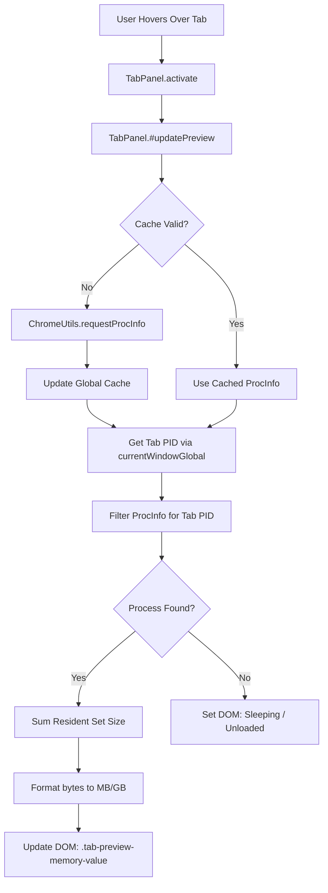

# Architecture Design: Tab Memory Indicator

> Phase 5: Designing data flows, caching, UI structure, and refresh strategies.

This document details the architectural design for displaying tab memory usage in Zen Browser's hover cards.

---

## 1. Data Flow Architecture

The data retrieval flows from the operating system's kernel through Gecko's process-tools to the privileged frontend browser chrome window.



---

## 2. UI Flow and DOM Integration

To minimize compatibility issues with upstream Firefox updates, we will inject the new DOM elements programmatically using JavaScript rather than patching the main `browser.xhtml` document markup directly.

### Injected DOM Structure
The memory info will be appended inside `.tab-preview-text-container` so it naturally stacks below the title and URI.

```html
<div class="tab-preview-text-container">
  <div class="tab-preview-title">Page Title</div>
  <div class="tab-preview-uri">example.com</div>
  
  <!-- Injected Memory Indicator Container -->
  <div class="tab-preview-memory-container" hidden="true">
    <span class="tab-preview-memory-icon">💾</span>
    <span class="tab-preview-memory-label">Memory Usage</span>
    <span class="tab-preview-memory-value">132 MB</span>
    <span class="tab-preview-memory-shared" hidden="true">(shared)</span>
  </div>
</div>
```

### CSS Styling Design
The container will be styled to match Zen Browser's premium design aesthetics:
- **Font Styling:** Deemphasized text color using CSS variables (`var(--text-color-deemphasized)`).
- **Layout:** Flex row with a small gap and margin for correct vertical spacing.
- **Icon:** Custom SVG or clean emoji positioned nicely with vertical alignment.

```css
.tab-preview-memory-container {
  display: flex;
  align-items: center;
  gap: 6px;
  margin-top: 6px;
  font-size: 0.9em;
  color: var(--text-color-deemphasized);
}
.tab-preview-memory-icon {
  opacity: 0.7;
}
.tab-preview-memory-value {
  font-weight: 500;
}
.tab-preview-memory-shared {
  font-size: 0.85em;
  opacity: 0.6;
}
```

---

## 3. Caching Strategy

Calling `ChromeUtils.requestProcInfo()` on every hover operation could cause brief UI stuttering if the user sweeps the cursor quickly across multiple tabs. To prevent this, we design a global cache manager.

### Cache Specification
- **Store:** Global variables in the `tab-hover-preview.mjs` module scope.
- **TTL (Time to Live):** `1500ms`.
- **Logic:**
  ```javascript
  let gProcCache = null;
  let gProcCacheTime = 0;

  async function getProcInfoCached() {
    const now = Date.now();
    if (gProcCache && (now - gProcCacheTime < 1500)) {
      return gProcCache;
    }
    gProcCache = await ChromeUtils.requestProcInfo();
    gProcCacheTime = now;
    return gProcCache;
  }
  ```

---

## 4. Refresh Strategy

### Hover Entry (Static Snapshot)
When the user hovers over a tab, the memory value is resolved once and displayed. This matches Chrome's default behavior, which prioritizes low CPU overhead over live-updating tooltips.

### Multi-Tab Selection / State Modifications
If the tab state changes (e.g., tab is discarded/sleeping or selected) while the hover panel is open, the standard event listeners (`TabAttrModified`, `TabSelect`) will trigger `#updatePreview()`, which automatically refreshes the memory value.

---

## 5. Required Backend Changes

None.
- **Gecko Internals:** No modifications are needed to C++, XPCOM services, or built-in Firefox configuration files.
- **Build System:** Zen Browser's build pipeline applies patches during initialization. We will supply the code as a single `.patch` file targeting the existing `tab-hover-preview.mjs` frontend module.
